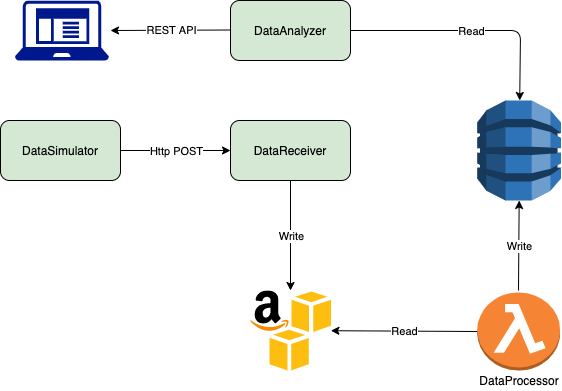

# Runbook

### Architecture diagram of the system that needs to be deployed

##### More information can be found in the [README](https://github.com/distributed-analytics-system/DistributedSystem-Docs/blob/main/README.md) file.

### Deployment strategy

- Deploy DynamoDB
- Create bucket in S3
- Deploy [DataReceiver](https://github.com/distributed-analytics-system/DistributedSystem-DataReceiver/blob/main/README.md) microservice
Make sure the service is running successfully by checking the logs. There should be **Running in production environment** info log. If the service won't run successfully, make sure all environment variables are set properly. If nothing works, contact the owner of the service by this email: vahagsaribeyan@gmail.com
- Deploy [DataProcessor](https://github.com/distributed-analytics-system/DistributedSystem-DataProcessor/blob/main/README.md) Lambda function
- Deploy [DataAnalyzer](https://github.com/distributed-analytics-system/DistributedSystem-DataAnalyzer/blob/main/README.md) microservice
Make sure the service is running successfully by checking the logs. There should be **Running in production environment** info log. If the service won't run successfully, make sure all environment variables are set properly. If nothing works, contact the owner of the service by this email: vahagsaribeyan@gmail.com
- Deploy [DataSimulator](https://github.com/distributed-analytics-system/DistributedSystem-DataSimulator/blob/main/README.md) microservice
Make sure the service is running successfully by checking the logs. There should be **Running in production environment** info log. If the service won't run successfully, make sure all environment variables are set properly. If nothing works, contact the owner of the service by this email: vahagsaribeyan@gmail.com

### Rollback plan

As this is brand new system, nothing to be rollbacked here. Just in case of issues reach out to developers for further investigation.
